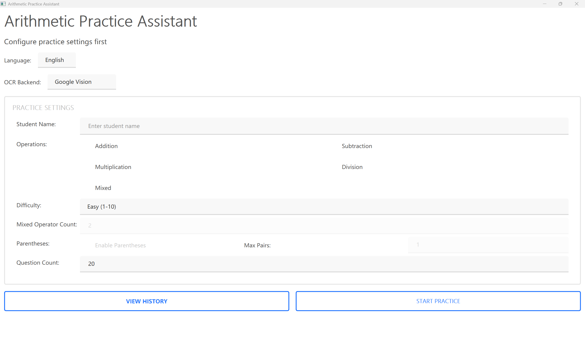
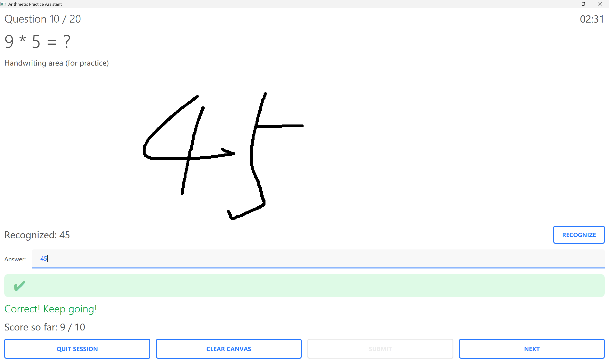
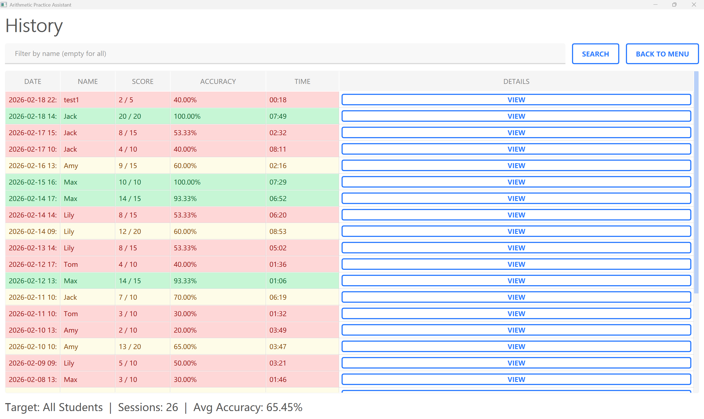
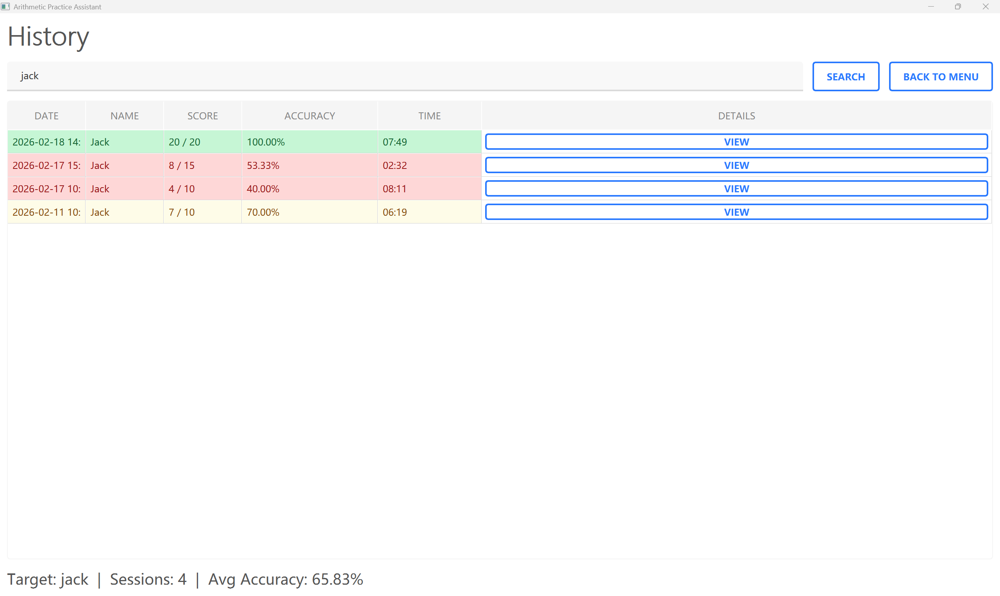
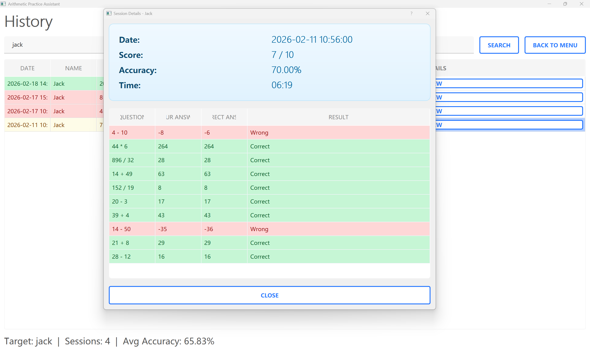

# Arithmetic Practice Assistant (PyQt)

A desktop arithmetic practice system built with Python + PyQt5, featuring a layered and decoupled architecture.

## Features

- Student name input for session identification
- Configurable question generation
  - Operation types: addition, subtraction, multiplication, division, and mixed operations
  - Difficulty ranges: 1-10 / 1-50 / 1-100
  - Number of operators in mixed mode
  - Parentheses toggle and max bracket pairs
  - Question count (5-50)
- One-by-one answering with instant feedback (correct / wrong)
- Handwriting digit recognition (manual recognize button + auto-recognition fallback on submit)
- Automatic score and accuracy tracking
- Session results saved to `data/history.csv`
- History lookup (filter by name) with detail view (questions, answers, correctness)
- Child-friendly large-font UI (>=14pt)
- Chinese / English language switching (Language dropdown on Setup page)

## Screenshots

### Setup Page

Configure student name, operations, difficulty, and question count before starting a session.



### Practice & Handwriting Recognition

Answer questions one by one; write digits on the canvas and the app recognizes them automatically.



### History – All Students

View all session records with color-coded accuracy (green >= 80%, yellow >= 60%, red < 60%).



### History – Filtered by Name

Filter history by student name to track individual progress.



### Session Details

Click "View" to inspect every question, your answer, the correct answer, and the result.



## Architecture

- `app/domain` – Pure data models
- `app/services` – Question generation and session scoring logic
- `app/repositories` – CSV persistence (read / write)
- `app/controllers` – Orchestration between UI and business layer
- `app/ui` – Page components and main window

## Getting Started

1. Install dependencies

```bash
pip install -r requirements.txt
```

2. Run the application

```bash
python main.py
```

## Data Files

- History records are saved to: `data/history.csv`

## Development

- Architecture, coding conventions, and extension guide: `docs/DEVELOPMENT.md`
